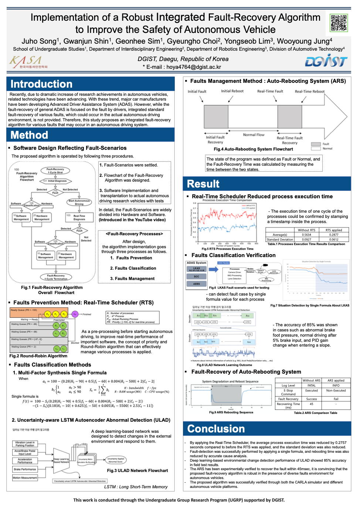
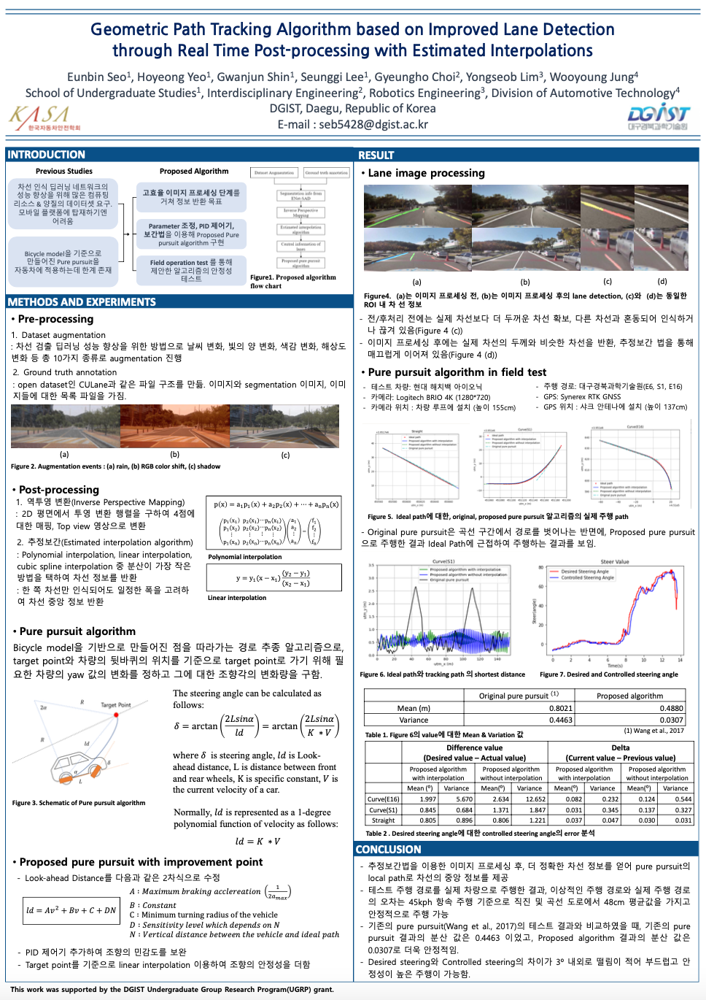

# Publication

## Reports
  1. KASA International Autonomous Vehicle Competition Technical Reports (PDF)   
      _2020 ARTIV Members_

  2. (AWARDED) KASA International Autonomous Vehicle Competition - Technical Excellence (Virtual Oral Presentation)

  <iframe width="560" height="315" src="https://www.youtube.com/embed/TB9S6XT2VhI" frameborder="0" allow="accelerometer; autoplay; clipboard-write; encrypted-media; gyroscope; picture-in-picture" allowfullscreen></iframe>


## Papers
  1. Estimation of the Closest In-Path Vehicle by Low-Channel LiDAR and Camera Sensor Fusion for Autonomous Vehicles (MDPI Sensors 2021) [link](https://www.mdpi.com/1424-8220/21/9/3124)
  <details>
  <summary>Cite this paper (Bae2021Estimation)</summary>
  <div markdown="1">       

  ``` 
  @Article{s21093124,
  AUTHOR = {Bae, Hyunjin and Lee, Gu and Yang, Jaeseung and Shin, Gwanjun and Choi, Gyeungho and Lim, Yongseob},
  TITLE = {Estimation of the Closest In-Path Vehicle by Low-Channel LiDAR and Camera Sensor Fusion for Autonomous Vehicles},
  JOURNAL = {Sensors},
  VOLUME = {21},
  YEAR = {2021},
  NUMBER = {9},
  ARTICLE-NUMBER = {3124},
  URL = {https://www.mdpi.com/1424-8220/21/9/3124},
  ISSN = {1424-8220},
  ABSTRACT = {In autonomous driving, using a variety of sensors to recognize preceding vehicles at middle and long distances is helpful for improving driving performance and developing various functions. However, if only LiDAR or cameras are used in the recognition stage, it is difficult to obtain the necessary data due to the limitations of each sensor. In this paper, we proposed a method of converting the vision-tracked data into bird’s eye-view (BEV) coordinates using an equation that projects LiDAR points onto an image and a method of fusion between LiDAR and vision-tracked data. Thus, the proposed method was effective through the results of detecting the closest in-path vehicle (CIPV) in various situations. In addition, even when experimenting with the EuroNCAP autonomous emergency braking (AEB) test protocol using the result of fusion, AEB performance was improved through improved cognitive performance than when using only LiDAR. In the experimental results, the performance of the proposed method was proven through actual vehicle tests in various scenarios. Consequently, it was convincing that the proposed sensor fusion method significantly improved the adaptive cruise control (ACC) function in autonomous maneuvering. We expect that this improvement in perception performance will contribute to improving the overall stability of ACC.},
  DOI = {10.3390/s21093124}
  }
  ```
  </div>
  </details>
    2. Hybrid tracker based optimal path tracking system for complex road environments for autonomous driving (submitted to IEEE Access) [arXiv](https://arxiv.org/abs/2104.14285)


  <details>
  <summary>Cite this paper (seo2021hybrid)</summary>
  <div markdown="1">       

  ``` 
@Article{seo2021hybrid,
      title={Hybrid tracker based optimal path tracking system for complex road environments for autonomous driving}, 
      author={Eunbin Seo and Seunggi Lee and Gwanjun Shin and Hoyeong Yeo and Yongseob Lim and Gyeungho Choi},
      year={2021},
      eprint={2104.14285},
      archivePrefix={arXiv},
      primaryClass={cs.RO}
}
  ```
  </div>
  </details>
  


## Posters
  2020 KASA Conference Winter Session
  
  |Implementation of a Robust Integrated Fault-Recovery Algorithmto Improve the Safety of Autonomous Vehicle|Geometric Path Tracking Algorithm based on Improved Lane Detection through Real Time Post-processing with Estimated Interpolations|
|:---:|:---:|
|||
|Juho Song, Gwanjun Shin, Geonhee Sim, Gyeungho Choi, Yongseob Lim, Wooyoung Jung|Eunbin Seo, Hoyeong Yeo, Gwanjun Shin, Seunggi Lee, Gyeungho Choi, Yongseob Lim, Wooyoung Jung|


## Conference Oral
  1. (Virtual) 


